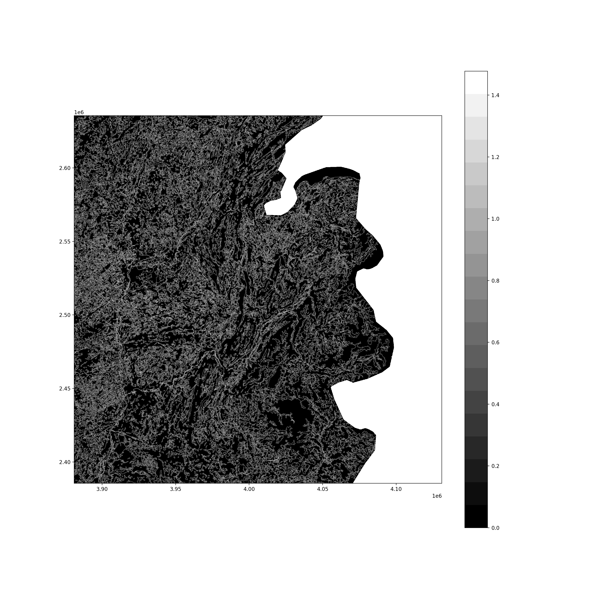
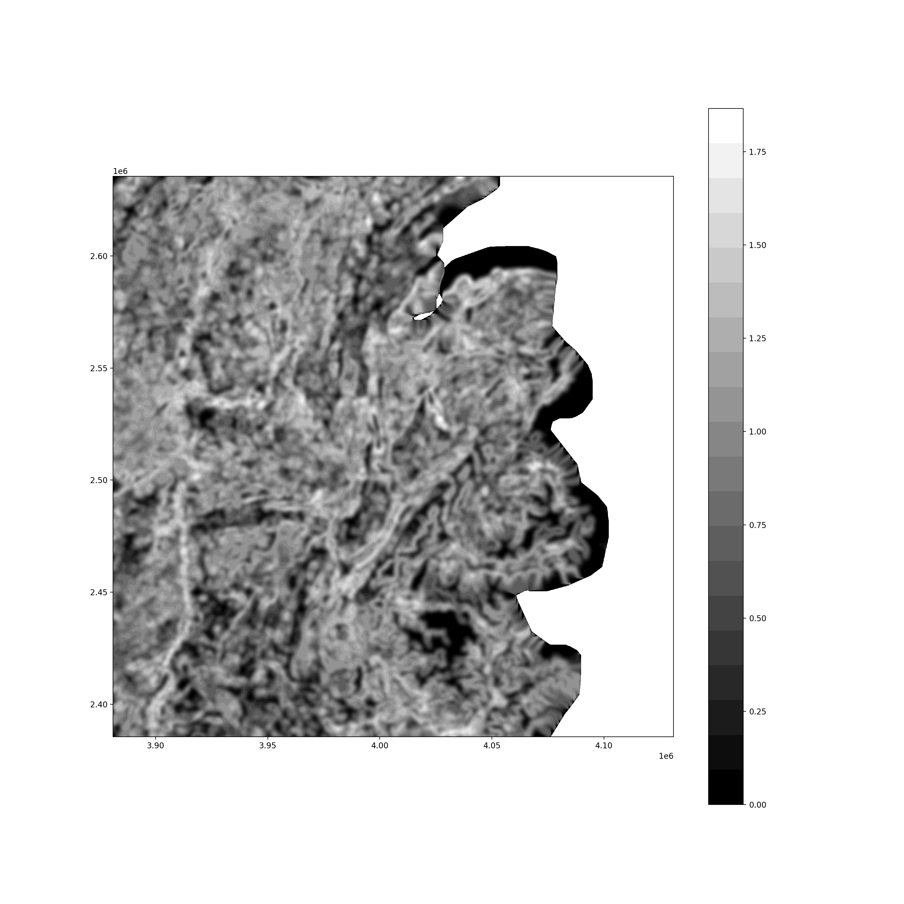
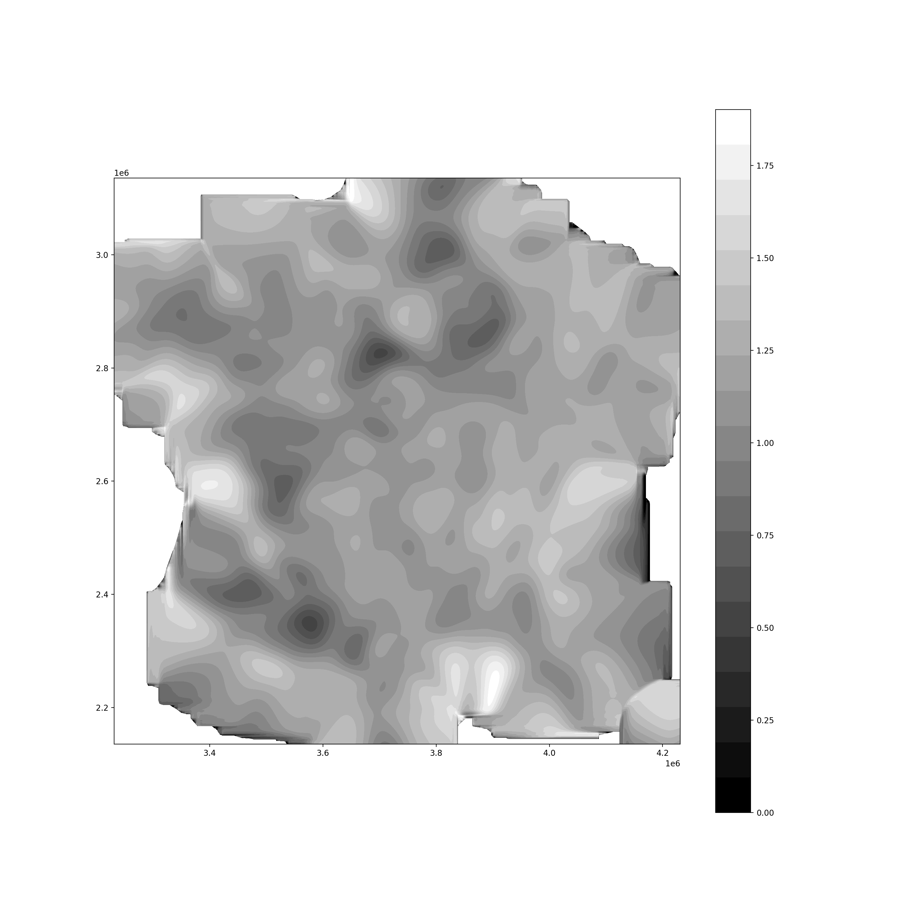

# Landiv Blur

Package to compute diversity measures in land-cover type maps

## Installation

_Note:_
_This package relies on [rasterio](https://rasterio.readthedocs.io/en/latest/index.html)_
_which partially depends on [libgdal](https://gdal.org/)._
_If you follow the installation instructions below you will attempt to install_
_rasterio from the Python Package Index in which chase the libgdal library_
_will be shipped along._
_However, if you encounter any issues with the installaiton of rasterio, head_
_over to the [rasterio installation insructions](https://rasterio.readthedocs.io/en/stable/installation.html) for more details._


To install `landiv_blur`:

1. Clone this repository
1. `cd` into the repository
1. Run `pip3 install .`


## Usage

Head over to the [examples/](examples/) folder for some usage examples.

There is also a command line executable (_under construction_) that can
directly process `.tif` files.
After installation, type `landiv --help` in your terminal for further details
on how to use it.

<!--- quickstart --->

### Running with OnDemand on cluster.s3it.uzh.ch

In order to apply the filters to sizeable maps we are in need of adequate
resources that are provided, for example, by the SLURM cluster maintained by
s3it.uzh.ch.
Luckily, s3it provides the OnDemand framework, which allows to run a jupyter
lab on resources provided through SLURM.
The advantage of such approach lies in the abstraction layer that allows to
distribute the workload much like one would parallelize on a single multi-core
server.

Setting up a jupyter lab for our analysis requires some preparatory steps:

1. Login to cluster.s3it.uzh.ch with `ssh -l shortname cluster.s3it.uzh.ch`
1. Create ssh key-pair with `ssh-keygen`. Make sure to **set a password
   protection** for the key.
1. Add the just generate public key (the \<something\>.pub) to your ssh keys
   on https://git.math.uzh.ch/-/profile/keys
1. Clone the landiv project into your home folder on the cluster
1. Build and install our custom kernel (called `landiv` kernel ) by running:
   ```
   chmod +x landiv_kernel.sh
   bash ./landiv_kernel.sh
   ```

1. Got to apps.s3it.uzh.ch and select `Jupyter Server` from the drop-down
   menu `Interactive Apps`
1. Reserve the required amount of CPU's and RAM (a good ratio is 1/4)
1. Leave GPU to None as we are not using them in this project
1. Select a runtime that is longer than the complete processing time
   (to determine).

   _Note:_ You can always delete the interactive session, which will also free
   up the reserved resources.
1. Hit `Launch` and wait for the jupyter server to start and the click on the
   'Connect to Jupyter` button
1. Under 'Notebook' there will be a python symbol with the name `landiv`, click
   on it to start a notebook with our custom kernel.
1. Now you can start using the landiv package and all of its dependencies.
   


## Previews


## Individual layers


### Individual layers with Gaussian filter


_sigma = 1_

_sigma = 10_

_sigma = 40_

## Entropy after diffusion



_sigma = 1_

---


_sigma = 10_

---


_sigma = 40_

---

<br>

<p align="center">


</p>

<br>

---
---

# Bigger map

<br>

<p align="center">


</p>

<br>


In principle this approach can be adapted also for landscape blocks consisting of a block of pixels and thus an initial distributions with resulting entropy.
Therefore, there are two way to include scale effects:

- the standard deviation of the diffusion kernel
- the landscape block size
