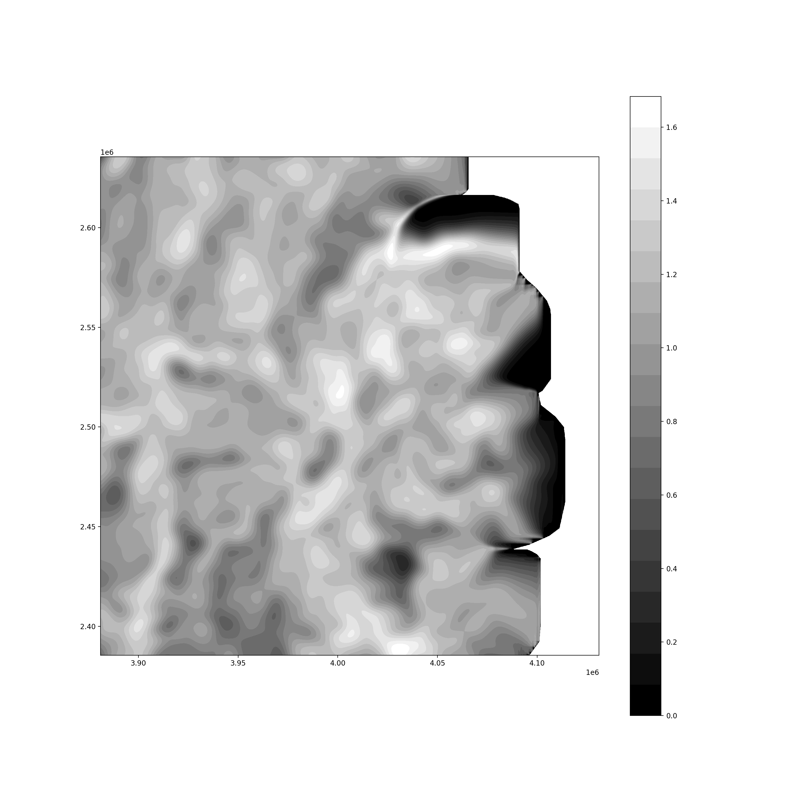
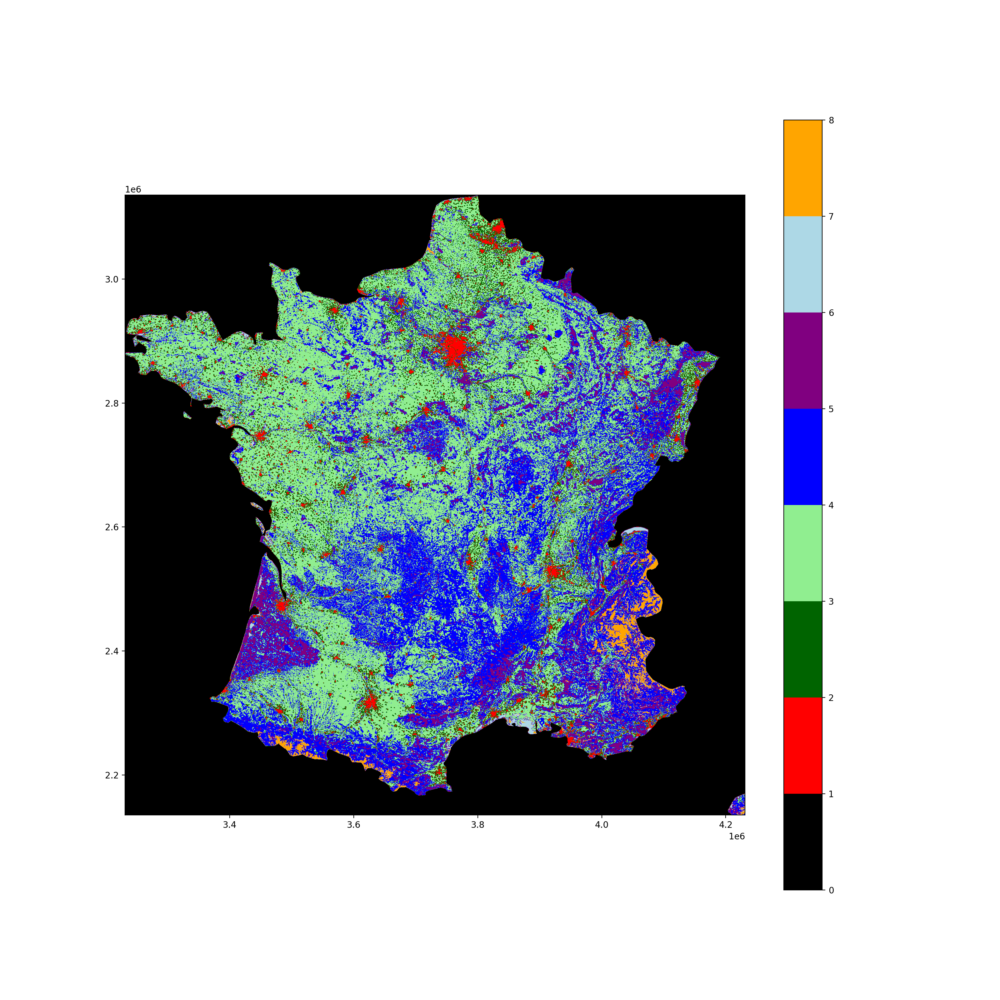

# Landiv Blur

Package to compute diversity measures in land-cover type maps

## Installation

_Note:_
_This package relies on [rasterio](https://rasterio.readthedocs.io/en/latest/index.html)_
_which partially depends on [libgdal](https://gdal.org/)._
_If you follow the installation instructions below you will attempt to install_
_rasterio from the Python Package Index in which chase the libgdal library_
_will be shipped along._
_However, if you encounter any issues with the installaiton of rasterio, head_
_over to the [rasterio installation insructions)[https://rasterio.readthedocs.io/en/stable/installation.html) for more details._

To install `landiv_blur`:

1. Clone this repository
1. `cd` into the repository
1. Run `pip3 install .`

## Usage

Head over to the [examples/](examples/) folder for some usage examples.

There is also a command line executable (_under construction_) that can
directly process `.tif` files.
After installation, type `landiv --help` in your terminal for further details
on how to use it.

## Previews

## Individual layers

### Individual layers with Gaussian filter

_sigma = 1_

_sigma = 10_

_sigma = 40_

## Entropy after diffusion

_sigma = 1_

---

_sigma = 10_

---

_sigma = 40_

---

 

 

---
---

# Bigger map

 

 

In principle this approach can be adapted also for landscape blocks consisting of a block of pixels and thus an initial distributions with resulting entropy.
Therefore, there are two way to include scale effects:

- the standard deviation of the diffusion kernel
- the landscape block size
