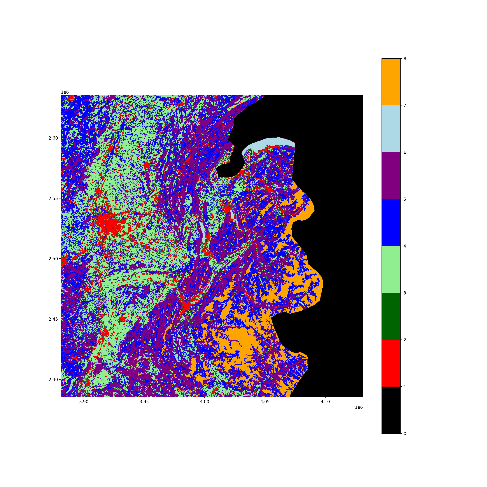

<div align="center">


<p>
  
  
  <a href="https://choosealicense.com/licenses/mit/">
    
  </a>
</p>

<br>

</div>
<div align="center">
  <h3>$\huge \mathsf{\textbf{GeoRacoon}}$<h3>
</div>
<div align="center">


<p>Out and about<br><><br>ready to tackle Geographic Raster</p>

<h2 align="center"></h2>

<p>$\color{gray}{\mathsf{A\ harvest\ from\ a\ collaboration\ between:}}$</p>
<p></p>


<br>

  <picture>
    <source media="(prefers-color-scheme: dark)" srcset="https://www.cd.uzh.ch/dam/jcr:e2f01a3c-e263-427a-91d7-723fc337af4b/uzh-logo.svg">
    <source media="(prefers-color-scheme: light)" srcset="https://www.cd.uzh.ch/dam/jcr:e2f01a3c-e263-427a-91d7-723fc337af4b/uzh-logo.svg">
    
  </picture>
  &nbsp; &nbsp; &nbsp; &nbsp; &nbsp; &nbsp; &nbsp; &nbsp;
  <picture>
    <source media="(prefers-color-scheme: dark)" srcset="https://raw.githubusercontent.com/t4d-gmbh/.github/main/static/logo/logo_with_Ds_wb.svg">
    <source media="(prefers-color-scheme: light)" srcset="https://raw.githubusercontent.com/t4d-gmbh/.github/main/static/logo/logo_with_Ds.svg">
    
  </picture>

  <br>

  <strong>$\small \color{gray}{\mathbf{UZH}}$</strong>
      &nbsp; &nbsp; &nbsp; &nbsp; &nbsp; &nbsp; &nbsp; &nbsp; &nbsp; &nbsp; &nbsp; &nbsp; &nbsp; &nbsp; &nbsp; &nbsp; &nbsp; &nbsp; &nbsp; &nbsp; &nbsp; &nbsp; &nbsp; &nbsp; &nbsp; &nbsp; &nbsp; &nbsp; &nbsp; &nbsp; &nbsp; &nbsp; &nbsp; &nbsp; &nbsp; &nbsp; &nbsp;
  <strong>$\small \color{gray}{\mathbf{T4D\ GmbH}}$</strong>


<h2 align="center"></h2>

<h2 align="center"></h2>


</div>


# GeoRacoon

<!-- badges: start -->
[](https://github.com/GeoRacoon/georacoon/tree/python-coverage-comment-action-data)

<!-- badges: end -->

This project is an extension of [RasterIO](https://rasterio.readthedocs.io/en/stable/) (rio) allowing to work with Sources (GeoTIFFS) and Bands as objects, which easily incorporate the use of tags.

_GeoRacoon_ provides 3 packages, `riogrande`, `convster` and `coonfit`, which facilitate (in our opinion) working with TIFF files.

- **RioGrande** provides the great heart of the GeoRacoon and adds functionality for parallel processing using Windows, dataset compatibility checks, data type 
conversion, mask and selector creation as well as simple file compression.  
- **Convster** allows for (gaussian) convolution of raster files using parallelized processing, _coon-style_. 
While gaussian and border-preserving gaussian filters are default parameters, other filters can be used.
- **CoonFit** allows to fit linear moodls the _coon-way_, meaning parallelized and fast, while understanable due to the
reliance on matrix operations

<!-- quickstart -->




**Table of Contents**

- [Installation](#installation)
- [Usage](#usage)
- [Technologies](#technologies)
- [Features](#features)
- [Authors](#authors)
- [Release History](#release-history)
- [License](#license)

## Installation

GeoRacoon can be installed directly from GitHub into your virtual environment.
Simply run:

```
pip install git+https://github.com/ReoRacoon/georacoon.git
```

<details>
<summary><b>Local install</b></summary>

Alternatively, you can clone the repository and install the package from your
local copy.
This might be the desired strategy if you intend to work on the source code, in
which case you can replace `install` by `install -e` and modify the files
in-place.


To install:
1. Clone this repository
1. `cd` into the repository

On macOS and Linux:

```sh
$ python -m pip install .
```

On Windows:

```sh
PS> python -m pip install .
```
</details>

_Note:_
_This package relies on [rasterio](https://rasterio.readthedocs.io/en/latest/index.html)_
_which partially depends on [libgdal](https://gdal.org/)._
_If you follow the installation instructions below you will attempt to install_
_rasterio from the Python Package Index in which chase the libgdal library_
_will be shipped along._
_However, if you encounter any issues with the installaiton of rasterio, head_
_over to the [rasterio installation insructions](https://rasterio.readthedocs.io/en/stable/installation.html) for more details._

_We also use the python package `gdal` which depends on `libgdal` that has been installed (see comment above)._
_It is important to install matching version, so first check with `gdalinfo --version` what version of `libgdal`_
_you have installed and then install the corresponding python package with `pip install gdal==x.x.x`._


## Usage

To run RioGrande, fire up a terminal window and run the following command:

```sh
$ <project>
```

Here are a few examples of using the riogrande library in your code:

```python
from riogrande.io import Source, Band

s = Source("example.tif")
s

b1 = s.get_band(bidx=1)
b1

b1.tags

...
```

Head over to the [examples/](examples/) folder for some usage examples.


For more examples, please refer to the project's [documentation page](docs).

## Technologies

RioGrande uses the following technologies and tools:

- [Python](https://www.python.org/): 


## Features

RioGrande currently has the following set of features:

- Support for...
- ...

## Contributing

To contribute to the development of RioGrande, follow the steps below:

1. Fork RioGrande from <https://github.com/yourusername/yourproject/fork>
2. Create your feature branch (`git checkout -b feature-new`)
3. Make your changes
4. Commit your changes (`git commit -am 'Add some new feature'`)
5. Push to the branch (`git push origin feature-new`)
6. Create a new pull request


## Authors
<a href="https://github.com/GeoRacoon">

</a>

## Release History

- 1.0.0
    - First working version

## License

RioGrande is distributed under the < license > license.

## Acknowledgements

Mention
